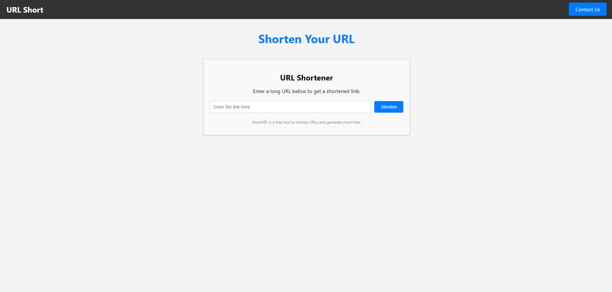
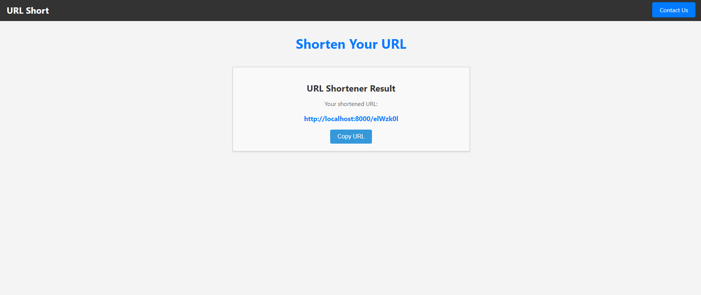
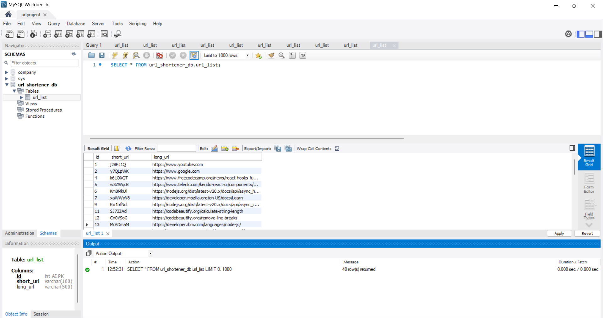

# URL Shortener

## About the Project

This project is a URL shortener service that includes a frontend built with React.js and a backend built with Node.js and Express. It allows users to shorten long URLs for easier sharing and tracking. The application's frontend provides an intuitive user interface for creating and retrieving shortened URLs, while the backend server handles all the logic and database interactions.
### Repository Links
- [Frontend Repository](https://github.com/prashantuchariya1/UrlShortner.git)
- [Backend Repository](https://github.com/prashantuchariya1/UrlShortner-backend.git)

### Built With

- [React.js](https://reactjs.org/)
- [Node.js](https://nodejs.org/)
- [Express](https://expressjs.com/)
- [MySQL](https://www.mysql.com/)

## Images

### Prerequisites

Ensure you have the following installed:
- Node.js
- npm
- MySql
### Database Setup
Here are some common MySQL commands:

CREATE DATABASE url_shortener_db;

CREATE TABLE url_list (
    id INT AUTO_INCREMENT PRIMARY KEY,
    short_url VARCHAR(20) NOT NULL UNIQUE,
    long_url VARCHAR(2048) NOT NULL
)

### Contact
Your Name - prashantuchariya1@gmail.com
